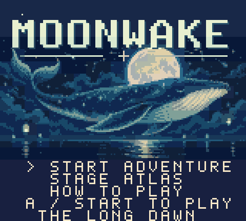
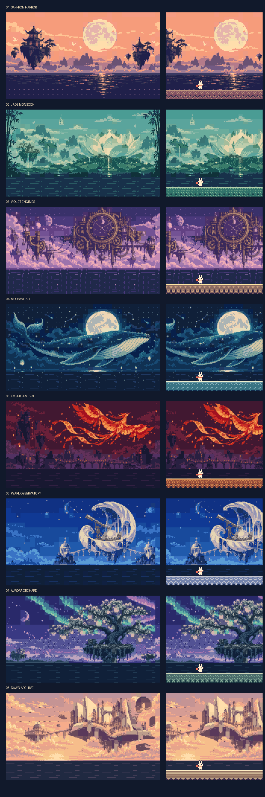

# Moonwake: The Long Dawn

**A little hare. A sleeping sky sea. One scarf to bring the morning home.**

An original side-scrolling platformer for **Game Boy Color and ModRetro Chromatic**. Explore peach pagoda roofs, giant lotus gardens, violet clockworks, a dreamwhale horizon, ember festivals, pearl observatories, aurora orchards, and the dawn archive. Made for a real 160 × 144 screen, with native pixel art and a four-channel chiptune score.



**[Download the ROM](https://github.com/sdiaoune/moonwake/releases/latest/download/moonwake.gbc)** · **[Play bundle](https://github.com/sdiaoune/moonwake/releases/latest/download/Moonwake-Play.zip)** · **[Player guide](docs/player-guide.md)** · **[Releases](https://github.com/sdiaoune/moonwake/releases)**

## A scarf worth following

Kip's comet dash carries you through lanterns and enemies. Land, touch a lantern, or defeat a foe to refill it; chain three interactions to recover a heart. Follow the main path or wander through roof galleries, sheltered grottos, returning loops, and tucked-away lantern rooms.

- Twenty-four long stages across eight illustrated worlds; each stage chains three continuous sections.
- 216 optional moon seals across 72 sections, with substantial side routes, lower passages, and scenic loops.
- Variable-height jumps, air dashes, drop-through ledges, moving balconies, gentle air currents, and drifting jelly foes.
- Four distinct guardians: Rainbell Warden, Comet Manta, Prism Sentinel, and Dreamwhale.
- A checkpoint in every section, unlimited retries, continuous transitions, story postcards, and an ending.
- Saved collection, best times, and S/A/B medals. S requires nine seals on the current run and a finish within par.
- Fifteen original 32-bar native music themes and eight sound effects.
- A 60–90 minute first-playthrough design target. Player pace varies; human completion timing has not been measured.



## Play

Download `moonwake.gbc` and load it in a Game Boy Color emulator or a compatible MBC5 flash cartridge. On Chromatic, write a compatible cartridge using **FlashGBX**. The original release remains available as [v1.0.0](https://github.com/sdiaoune/moonwake/releases/tag/v1.0.0). See the [validation notes](docs/validation.md) for the current build’s verification.

| Button | Action |
|---|---|
| D-pad | Move; navigate menus |
| A | Jump; hold for a higher leap; confirm |
| B | Comet dash |
| Down + A | Drop through a one-way ledge |
| Start | Pause, atlas, sound, and title options |
| Select | Retry the checkpoint |

Seals and stars stay with your current run after a retry. Press B twice on the title to start a new game. See the [player guide](docs/player-guide.md) for rank rules and finale hints.

For the browser preview, extract the play bundle or clone this repository, start a server, then open `http://localhost:8000/docs/play.html`:

```sh
python3 -m http.server 8000
```

Browser controls: arrows, Z = A, X = B, Enter = Start, Shift = Select. On-screen controls support simultaneous holds. The preview emulates the same `.gbc` file.

## Build and verify

Install [GBDK-2020 4.5.0](https://github.com/gbdk-2020/gbdk-2020/releases/tag/4.5.0), Python 3.12, and Make. Follow GBDK's [installation guide](https://gbdk.org/docs/api/docs_getting_started.html). The generated C art is checked in, so building the ROM needs only GBDK and Python's standard library.

```sh
git clone https://github.com/sdiaoune/moonwake.git
cd moonwake
make -B GBDK=/path/to/gbdk
```

The output is `dist/moonwake.gbc`: **512 KiB**, **CGB-only**, **MBC5 + battery-backed 8 KiB SRAM**. Download checksums accompany each release as `SHA256SUMS.txt`. The original ROM and its source remain available under the v1.0.0 tag.

Optional art, emulator, and music tooling:

```sh
python3 -m venv .venv
.venv/bin/python -m pip install -r requirements.txt
make check GBDK=/path/to/gbdk PYTHON=.venv/bin/python
.venv/bin/python tools/build_art.py --check
GBDK=/path/to/gbdk .venv/bin/python tools/render_music.py
```

The campaign check traverses all 72 sections and earns all 216 seals through controller input, then independently replays it from a fresh save and checks completion after reboot. See [development notes](docs/development.md) for optional probes and regeneration.

## Inside the cartridge

| Path | Contents |
|---|---|
| `src/` | Native C engine, menus, saves, stages, music, and banked graphics |
| `assets/source/` | Original scene paintings, prompts, and font foundation |
| `assets/native/` | Exact decoded tiles, sprites, and scenery |
| `tools/` | Art pipeline, ROM checks, controller playtests, and media capture |
| `docs/` | Design, research, routes, guide, soundtrack, and actual ROM captures |
| `dist/` | ROM, symbols, recorded controller input, and validation reports |

Moonwake was created with Codex and specialist subagents for art, levels, audio, and independent critique. Scenery starts with original AI-generated paintings; native sprites, foreground materials, typography, and music are authored in source. The exact prompts and conversion pipeline are included. The font foundation comes from the creator's earlier Signal Bloom project. No Mario or Sonic assets or music are used.

[Design](docs/design.md) · [Research](docs/research.md) · [Art pipeline](docs/art.md) · [Soundtrack](docs/soundtrack.md) · [Validation](docs/validation.md)

## License and contributions

Game code, tools, and documentation are **[MIT](LICENSE)**. Original artwork, font data, musical compositions, and rendered captures are **[CC BY 4.0](LICENSE-ASSETS)**. Credit **“Moonwake by sdiaoune”**, link to this repository and the asset license, and identify changes when reusing assets. Redistribution, modification, and commercial use are permitted.

The browser emulator and linked runtime libraries retain their own licenses; see [third-party notices](THIRD_PARTY_NOTICES.md). Distribute the applicable code, asset, and runtime notices with the ROM.

Forks, fixes, new routes, translations, and accessibility improvements are welcome. Read [CONTRIBUTING.md](CONTRIBUTING.md) and open an issue or pull request.
